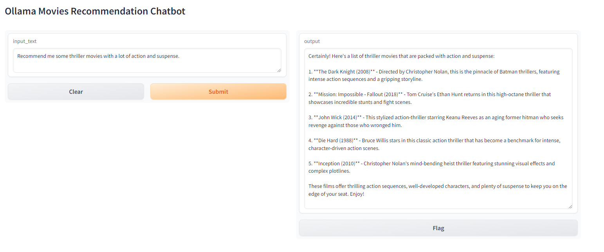

# Ollama Movies Recommendation Chatbot

## Installation

1. Clone the repository:

```sh
git clone https://github/cjzhi98/ollama-movie-gpt
```

2. Navigate to the project directory:

```sh
cd ollama-movie-gpt
```

3. Install the required Python packages:

```sh
pip install -r requirements.txt
```

4. Pull and run the [cjzhi98/movies-qdrant](https://hub.docker.com/repository/docker/cjzhi98/movies-qdrant/general) qdrant instance. This instance already has the movies embedding inside the collection "movies". You can see the [data_processing](https://github.com/cjzhi98/ollama-movie-gpt/tree/main/data_processing) folder for the steps to prepare the qdrant "movies" collection.

For more information, refer to the [data_processing] folder.

```sh
docker-compose up -d
```

## Running the Application

To run the application, use the following command:

```sh
python main.py
```

You can access the gradio chatbot at http://localhost:7860/

## Demo


